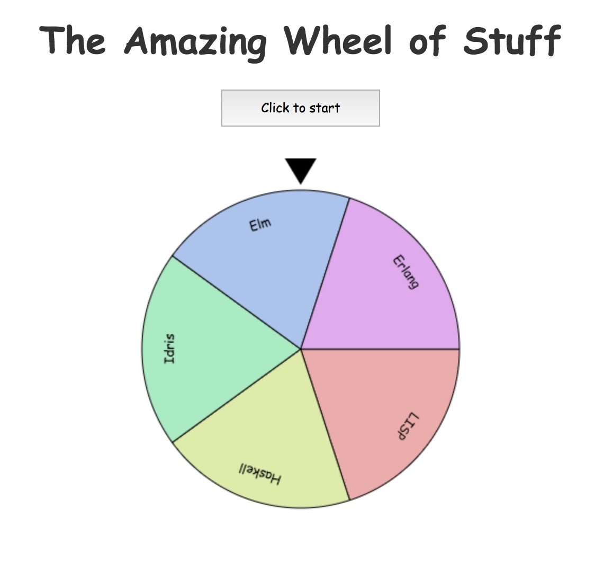

# TeamGrayhawk: schagly.io

## How to build:

First, download and install dependencies:

    $ npm install

Next, compile the typescript files:

    $ npm run build

...or, if you want automatic compilation when files are updated:

    $ npm run build:watch

This will produce `dist/bingo.js`.

Now start the http server:

    $ npm start

Browse to http://127.0.0.1:8080

If you want to change the entries in the BingoWheel, edit `index.html`.
